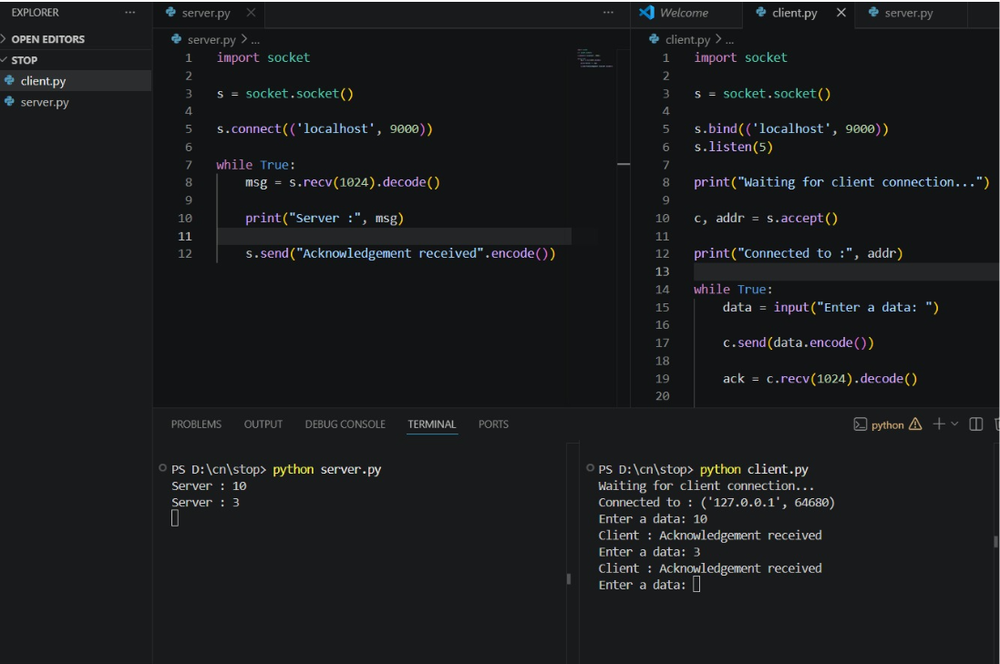

# 2a_Stop_and_Wait_Protocol
## AIM 
To write a python program to perform stop and wait protocol
## ALGORITHM
1. Start the program.
2. Get the frame size from the user
3. To create the frame based on the user request.
4. To send frames to server from the client side.
5. If your frames reach the server it will send ACK signal to client
6. Stop the Program
## PROGRAM
CLIENT:

import socket

s = socket.socket()

s.bind(('localhost', 9000)) s.listen(5)

print("Waiting for client connection...")

c, addr = s.accept()

print("Connected to :", addr)

while True: data = input("Enter a data: ")

c.send(data.encode())

ack = c.recv(1024).decode()

if ack:
    print("Client :", ack)
else:
    c.close()
    break
s.close()

SERVER:

import socket

s = socket.socket()

s.connect(('localhost', 9000))

while True: msg = s.recv(1024).decode()

print("Server :", msg)

s.send("Acknowledgement received".encode())
## OUTPUT

## RESULT
Thus, python program to perform stop and wait protocol was successfully executed.
